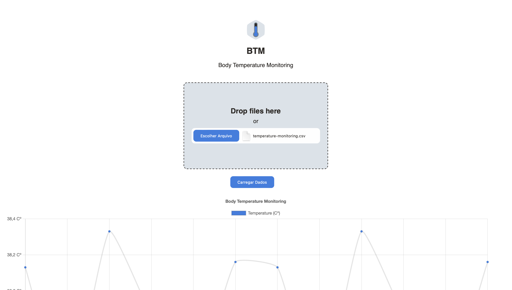
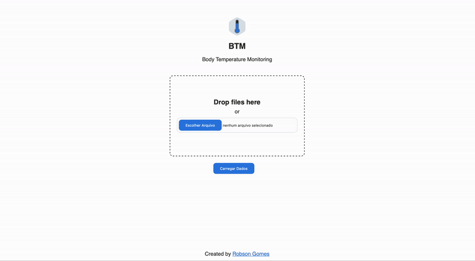

# Body Temperature Monitoring

This project, **Body Temperature Monitoring**, is an experimental frontend solution aimed at collecting CSV data from users and displaying representations of the contained data using HTML, CSS, and pure JavaScript along with the Chart.js and D3.js libraries.

## Overview

This repository contains a simple web application designed to facilitate the visualization of body temperature monitoring data. The CSV file uploaded by the user should follow a standardized format with the following columns: "timestamp", "temperature", and "magnitude".

Please note that this project is not a complete application but rather an experimentation with frontend solutions. It aims to showcase the integration of HTML, CSS, and JavaScript along with Chart.js and D3.js libraries for data visualization purposes.

## Features

- **Upload CSV**: Users can upload CSV files containing body temperature monitoring data.
- **Data Visualization**: The application generates visual representations of the temperature data using Chart.js and D3.js.
- **Interactive Charts**: Users can interact with the generated charts to explore the temperature data further.

## Usage

1. Clone this repository to your local machine.
2. Open the `index.html` file in your web browser.
3. Use the provided interface to upload a CSV file containing temperature monitoring data.
4. Explore the generated visualizations.

## Technologies Used

- HTML
- CSS
- JavaScript
- [Chart.js](https://www.chartjs.org/)
- [D3.js](https://d3js.org/)

## Future Improvements

Here are some features that can be added to enhance the functionality of the application:

- **Data Filtering**: Allow users to filter the displayed data based on specific criteria such as date range or temperature range.
- **Export Functionality**: Provide an option for users to export the visualized data in different formats such as PNG or PDF.
- **Data Analysis**: Integrate statistical analysis tools to provide insights into the temperature data.
- **Responsive Design**: Ensure the application is fully responsive to provide a consistent experience across different devices.

## Contributing

Contributions are welcome! If you have any ideas for improvements or new features, feel free to submit issues or pull requests.

## License

This project is licensed under the [MIT License](LICENSE).

## Demo

### Moving
